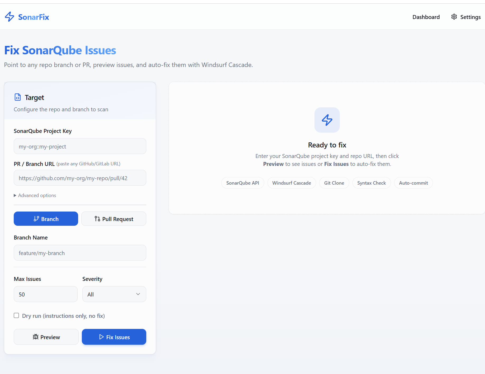
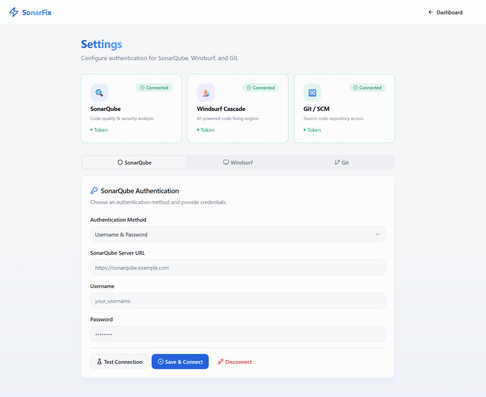

<div align="center">

# SonarFix Agent


**SonarQube finds the bugs. SonarFix fixes them.**

Point SonarFix at any branch or pull request, and it automatically repairs SonarQube issues using an LLM — then commits, pushes, and optionally opens a PR with the fixes.

---

## Why SonarFix?

SonarQube surfaces thousands of issues but leaves fixing them entirely to developers.
SonarFix closes that loop: it reads each SonarQube issue in context, sends the file + issue + RAG-retrieved past fixes to an LLM, validates the result with a language-specific syntax check, and commits only clean code.

---

[](https://github.com/madhupathy/sonarfix-agent/actions/workflows/ci.yml)
[](https://python.org)
[](pyproject.toml)

</div>

---

## The Problem

Every team with SonarQube has the same backlog. Hundreds of open issues — BUGs, VULNERABILITIEs, CODE_SMELLs — that everyone acknowledges but nobody fixes because:

- **Each fix requires context**: open the file, find the issue, understand the rule, apply the fix
- **Batch fixing is tedious**: 40 issues across 15 files means 15 separate PRs or one massive untraceable commit
- **False positives waste time**: you have to preview issues before deciding what to automate
- **LLM fixes break syntax**: naive "just ask GPT" approaches produce code that doesn't compile

SonarFix Agent solves this with a pipeline that handles context intelligently, validates every fix before committing, and learns from past successes.

---

## Screenshots

**Dashboard — preview issues and launch fix jobs**



**Settings — configure SonarQube, LLM, and Git connections**



---

## How It Works

Paste your PR URL. Preview the open SonarQube issues. Click Fix. The agent runs each file through a state-machine pipeline:

```
SonarQube ──────────────────────────────────────────────────────────────────┐
  (issues API)                                                                │
                                                                              │
          ┌───────────────────────────────────────────────────────────────┐   │
          │             SonarFix Agent  (FastAPI :8000 / CLI)             │   │
          └────────┬──────────────────────────────────────────────────────┘   │
                   │                                                           │
     ┌─────────────▼─────────────────────────────────────┐                   │
     │              Fix Graph  (per-file state machine)   │◀──────────────────┘
     │                                                    │
     │  extract_context → retrieve_RAG → build_prompt    │
     │       → call_LLM → apply_fix → validate → store  │
     │              (retry up to 3× on failure)          │
     └──────┬───────────────────┬───────────────────────┘
            │                   │
        ┌───▼────┐         ┌────▼──────────────┐
        │  LLM   │         │  RAG Store         │
        │ (vLLM/ │         │  ~/.sonarfix/      │
        │ OpenAI)│         │  rag.db            │
        └───┬────┘         └───────────────────┘
            │
     ┌──────▼────────────┐      ┌─────────────────┐
     │  Git Manager       │─────▶│  Commit + Push  │
     │  (clone / branch) │      │  & Create PR    │
     └───────────────────┘      └─────────────────┘
```

---

## Quick Start

**Step 1 — Install**

```bash
pip install -e ".[dev]"        # from source
# or
pip install sonarfix-agent     # from PyPI (when published)
```

**Step 2 — Start the backend API**

```bash
uvicorn sonarfix.api:app --host 127.0.0.1 --port 8000 --reload

# Terminal 2: frontend
cd web && npm install && npm run dev
# → http://localhost:3000
```

**Step 3 — Start the web UI**

```bash
cd web && npm install && npm run dev
```

**Step 4 — Configure connections**

Open **http://localhost:3000/settings** and fill in:
- SonarQube URL + token
- LLM API key, model, and base URL (or leave defaults for a local vLLM server)
- Git Personal Access Token (needed for private repo cloning)

**Step 5 — Fix issues**

Go to **http://localhost:3000**, paste a PR or branch URL, enter your SonarQube project key, and click **Fix Issues**.

---

## GitHub Action Usage

Add SonarFix to any repository to auto-fix SonarQube issues on every PR:

```yaml
# .github/workflows/sonarfix.yml
name: SonarFix Auto-Repair

on:
  pull_request:
    types: [opened, synchronize, reopened]

permissions:
  contents: write
  pull-requests: write

jobs:
  sonarfix:
    runs-on: ubuntu-latest
    steps:
      - uses: actions/checkout@v4
        with:
          ref: ${{ github.head_ref }}
          fetch-depth: 0

      - name: Run SonarFix
        id: sonarfix
        uses: ./.github/actions/sonarfix
        with:
          sonarqube-url: ${{ secrets.SONARQUBE_URL }}
          sonarqube-token: ${{ secrets.SONARQUBE_TOKEN }}
          llm-api-url: ${{ vars.LLM_API_URL || 'https://api.openai.com/v1' }}
          llm-api-key: ${{ secrets.LLM_API_KEY }}
          llm-model: ${{ vars.LLM_MODEL || 'gpt-4o-mini' }}
          severity-filter: 'CRITICAL,MAJOR'
          create-pr: 'false'

      - name: Comment with fix summary
        if: steps.sonarfix.outputs.fixed-count != '0'
        uses: actions/github-script@v7
        with:
          script: |
            github.rest.issues.createComment({
              owner: context.repo.owner,
              repo: context.repo.repo,
              issue_number: context.issue.number,
              body: `### SonarFix fixed **${{ steps.sonarfix.outputs.fixed-count }}** issue(s)`,
            });
```

**Required secrets:** `SONARQUBE_URL`, `SONARQUBE_TOKEN`, `LLM_API_KEY`

**Action outputs:**
| Output | Description |
|--------|-------------|
| `fixed-count` | Number of issues fixed |
| `pr-url` | PR URL (when `create-pr: true`) |

---

## Configuration

All settings can be configured via the web UI Settings page or via environment variables / `.env` file.

| Variable | Description | Default |
|----------|-------------|---------|
| `SONARQUBE_URL` | SonarQube server URL | *(required)* |
| `SONARQUBE_USERNAME` | Basic auth username **or** API token | *(required)* |
| `SONARQUBE_PASSWORD` | Basic auth password (empty for token auth) | `""` |
| `LLM_API_KEY` | LLM API key (`dummy` for vLLM, real key for OpenAI/Azure) | `dummy` |
| `LLM_MODEL` | Model name served by your endpoint | `Qwen/Qwen2.5-72B-Instruct-AWQ` |
| `LLM_BASE_URL` | OpenAI-compatible API base URL | `http://localhost:8000/v1` |
| `LLM_TIMEOUT` | LLM request timeout in seconds | `600.0` |
| `SSL_VERIFY` | Set `false` to disable SSL verification (self-signed certs) | `true` |
| `WORKSPACE_DIR` | Directory for cloned repos | `~/.sonarfix/workspaces` |
| `GIT_PUSH_REMOTE` | Git remote name for pushing fix branches | `origin` |
| `GIT_USER_NAME` | Git commit author name | *(system git config)* |
| `GIT_USER_EMAIL` | Git commit author email | *(system git config)* |

> **Tip:** The Settings page is the easiest way to configure — no `.env` file needed.
> Credentials are stored in `~/.sonarfix/connections.json`.

---

## Supported Languages

SonarFix has built-in syntax validators for these languages. The LLM can fix any language that your model understands.

| Language | Extension | Syntax Validator | Notes |
|----------|-----------|-----------------|-------|
| Python | `.py` | `python -m py_compile` | Full support |
| Go | `.go` | `go vet` | Full support |
| JavaScript | `.js` | `node --check` | Full support |
| TypeScript | `.ts` | `node --check` | Full support |
| Java | `.java` | `javac` | Full support |
| Shell | `.sh` / `.bash` | `bash -n` | Full support |
| Ruby | `.rb` | `ruby -c` | Full support |
| PHP | `.php` | `php -l` | Full support |
| C# | `.cs` | *(LLM-only)* | No local validator |
| Other | * | *(LLM-only)* | Kotlin, Swift, Rust, Scala, C/C++, … |

For languages without a built-in validator, fixes are still applied — they just skip the local syntax check step. The LLM's output quality is the safety net.

---

## How RAG Works

Every time SonarFix successfully fixes an issue, it stores the before/after code snippet in a local SQLite database (`~/.sonarfix/rag.db`) along with a semantic embedding of the issue description.

On the next run, before calling the LLM, SonarFix:
1. **Searches by rule key** — retrieves exact past fixes for the same SonarQube rule.
2. **Searches by embedding similarity** — uses cosine similarity on sentence-transformer embeddings (`all-MiniLM-L6-v2`) to find semantically similar fixes even across different rules.
3. **Injects examples** into the LLM prompt as few-shot demonstrations.

This means SonarFix gets *better over time* — each successful fix makes the next run faster and more accurate for similar issues.

You can also seed the RAG store with your project's coding standards:

```bash
curl -X POST http://localhost:8000/api/rag/standards \
  -H 'Content-Type: application/json' \
  -d '{
    "source": "our-standards",
    "title": "Error handling in Go",
    "content": "All functions must return errors using fmt.Errorf with %w wrapping.",
    "language": "go"
  }'
```

**Embedding model:** Uses `sentence-transformers/all-MiniLM-L6-v2` (384-dim) if the optional `sentence-transformers` package is installed; falls back to trigram-hash pseudo-embeddings otherwise.

```bash
# Install for real semantic search
pip install "sonarfix-agent[embeddings]"
```

---

## Environment Variables

```bash
# List issues for a project/branch
sonarfix issues my-project --branch main
sonarfix issues my-project --pr 42 --severity BLOCKER,CRITICAL

# Full auto-fix pipeline
sonarfix run my-project --repo git@github.com:org/repo.git --branch develop
sonarfix run my-project --repo git@github.com:org/repo.git --pr 42

# Filter by severity and issue type
sonarfix run my-project --repo git@github.com:org/repo.git \
  --branch main \
  --severity BLOCKER,CRITICAL,MAJOR \
  --type BUG,VULNERABILITY \
  --max 30

# Dry run — generate fix instructions only
sonarfix run my-project --repo git@github.com:org/repo.git --branch main --dry-run

# Use an existing local clone (skip cloning)
sonarfix run my-project --repo git@github.com:org/repo.git --branch main --local /path/to/repo

# Auto-push fix branch after fixing
sonarfix run my-project --repo git@github.com:org/repo.git --branch main --auto-push
```

| Command | Description |
|---------|-------------|
| `sonarfix issues` | List SonarQube issues for a project/branch/PR |
| `sonarfix run` | Full pipeline: fetch → clone → plan → fix → validate → commit |
| `sonarfix validate` | Run syntax checks on modified files in a workspace |
| `sonarfix branches` | List branches for a SonarQube project |
| `sonarfix prs` | List pull requests for a SonarQube project |

---

## API Endpoints

| Method | Endpoint | Description |
|--------|----------|-------------|
| `GET` | `/api/health` | Health check |
| `GET` | `/api/connections` | List connector status |
| `POST` | `/api/connections/{connector}` | Save credentials |
| `DELETE` | `/api/connections/{connector}` | Disconnect |
| `POST` | `/api/connections/{connector}/test` | Test credentials without saving |
| `GET` | `/api/issues` | Preview SonarQube issues |
| `POST` | `/api/jobs` | Start a fix job (background thread) |
| `GET` | `/api/jobs?limit=20&offset=0` | List jobs (paginated, newest first) |
| `GET` | `/api/jobs/{id}` | Get job status + full log |
| `DELETE` | `/api/jobs/{id}` | Cancel a running/queued job |
| `POST` | `/api/jobs/{id}/apply` | Re-run a dry-run job as an actual fix |
| `POST` | `/api/jobs/{id}/push` | Push fix branch + create PR |
| `GET` | `/api/rag/stats` | RAG store counts (fix examples + standard docs) |
| `POST` | `/api/rag/standards` | Upload a coding standard document |
| `GET` | `/api/rag/fixes` | List stored fix examples |

---

## Project Structure

```
sonarfix/
├── api.py                       FastAPI backend (GUI ↔ CLI bridge, job persistence, RAG endpoints)
├── cli.py                       Typer CLI
├── config.py                    Pydantic settings (.env / environment)
├── db.py                        SQLite-backed job persistence (~/.sonarfix/jobs.db)
├── fixer/
│   ├── llm_fixer.py             LLM fixer — delegates to FixGraph pipeline
│   ├── graph.py                 Fix Graph state machine (extract → RAG → LLM → validate → retry)
│   ├── context_extractor.py     Smart chunking (imports + function blocks for large files)
│   ├── prompt.py                Prompt templates
│   └── planner.py               Batch orchestrator
├── sonarqube/
│   ├── client.py                SonarQube API client (httpx)
│   ├── models.py                Pydantic models (Issue, Rule, Component)
│   └── filters.py               Group / rank / deduplicate issues
├── git/
│   └── manager.py               GitPython wrapper (clone, branch, commit, push)
├── rag/
│   └── store.py                 SQLite RAG store with sentence-transformer embeddings
├── validator/
│   └── checker.py               Language-specific syntax checks + diff summary
└── reporting/
    └── report.py                JSON + Markdown fix reports

web/
├── app/
│   ├── page.tsx                 Dashboard (issue preview, fix jobs, language badges)
│   ├── settings/page.tsx        Connections + statistics panel
│   ├── history/page.tsx         Fix history (filterable, sortable, expandable, paginated)
│   └── globals.css
├── components/
│   ├── language-badges.tsx      Supported language badges with tooltip
│   └── ui/                      shadcn/ui primitives
├── lib/utils.ts
└── next.config.mjs              API proxy rewrite → :8000

.github/
├── actions/sonarfix/action.yml  Composite action for CI/CD integration
└── workflows/sonarfix-example.yml

tests/                           93 tests across 9 files
```

---

## Running Tests

```bash
pytest -v
# 93 tests across: filters, models, llm_fixer, planner, context_extractor,
#                  graph, rag_store, report, windsurf
```

---

## Tech Stack

| Component | Technology |
|-----------|------------|
| Language | Python 3.9+ |
| CLI | Typer + Rich |
| Config | pydantic-settings |
| HTTP | httpx |
| Git | GitPython |
| Code fixer | LLM via OpenAI-compatible API |
| Fix pipeline | Graph-based state machine with retry + validation |
| RAG store | SQLite + sentence-transformers (`all-MiniLM-L6-v2`) |
| Job persistence | SQLite (`~/.sonarfix/jobs.db`) |
| Backend API | FastAPI + Uvicorn |
| Frontend | Next.js 14, React 18, Tailwind CSS 3, shadcn/ui |
| Icons | Lucide React |
| Notifications | Sonner |

---

## Contributing

1. Fork the repo and create a feature branch.
2. Install dev dependencies: `pip install -e ".[dev,all]"`
3. Make your changes. Add tests in `tests/`.
4. Run `pytest -v` and make sure all tests pass.
5. Open a pull request with a clear description of what you changed and why.

**Areas that welcome contributions:**
- Additional language validators (Kotlin, Swift, Rust, C/C++)
- Alternative LLM providers (Anthropic Claude, Google Gemini)
- UI improvements to the web dashboard
- Improved prompt templates for specific SonarQube rule families
- Performance improvements to the RAG similarity search

---

## License

MIT — see [LICENSE](LICENSE) for details.
